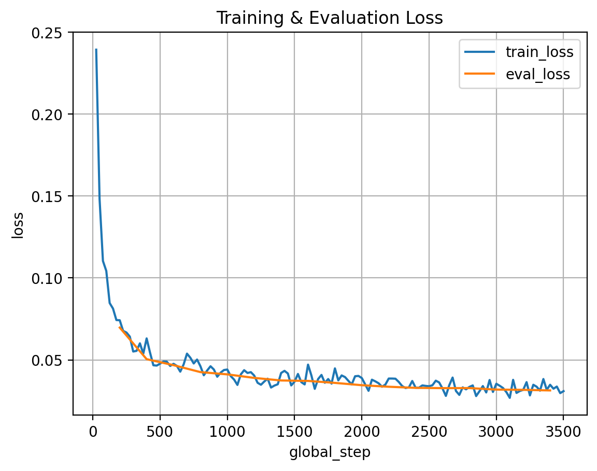

base_model: HuggingFaceTB/SmolLM2-360M-Instruct
library_name: peft
pipeline_tag: text-generation
tags:
- lora
- transformers
- text-to-sql
- finetuned
- instruction-tuning
  

# Text2SQL LoRA Model

A LoRA fine-tuned version of SmolLM2-360M-Instruct specialized for Text-to-SQL generation.  
This system translates natural language questions into SQL queries using a provided database schema.


## Project Overview

This project builds a Text-to-SQL system by fine-tuning a language model.  
The full pipeline includes:

- Dataset preprocessing  
- LoRA / QLoRA fine-tuning  
- Model evaluation  
- Inference tools  
- Web demo interface  


## Example Task

**Schema**
```sql
CREATE TABLE users (
    id INTEGER,
    name TEXT,
    age INTEGER,
    city TEXT
);
````

**Question**

```
Show all users older than 30
```

**Model Output**

```sql
SELECT name FROM users WHERE age > 30;
```


## More Example Inputs

| Question                           | Output SQL                                          |
| ---------------------------------- | --------------------------------------------------- |
| List all cities                    | `SELECT city FROM users;`                           |
| Show names of users in Paris       | `SELECT name FROM users WHERE city = 'Paris';`      |
| Count number of users              | `SELECT COUNT(*) FROM users;`                       |
| Find oldest user                   | `SELECT name FROM users ORDER BY age DESC LIMIT 1;` |
| Show all products with price > 100 | `SELECT * FROM products WHERE price > 100;`         |


## Model Overview

| Feature            | Description                |
| ------------------ | -------------------------- |
| Base Model         | SmolLM2-360M-Instruct      |
| Fine-Tuning Method | LoRA (Low-Rank Adaptation) |
| Task               | Natural Language to SQL    |
| Dataset            | WikiSQL                    |
| Framework          | Transformers + PEFT        |
| Language           | English                    |
| License            | MIT                        |


## Intended Use

### Direct Use

* Educational AI demonstrations
* SQL generation experiments
* NLP research projects

### Downstream Use

* Natural language database interfaces
* AI-powered query assistants
* Data analytics tools


## Bias, Risks & Limitations

This is a learning and experimental project created to explore LLM fine-tuning techniques. The system is not designed for real-world deployment.


## Project Structure

```
Text2SQL-Finetune/
│
├── scripts/
│   ├── preprocess_wikisql.py
│   ├── preprocess_wikisql_test.py
│   ├── train_lora.py
│   ├── eval_simple.py
│   ├── inference.py
│   ├── demo_compare.py
│   ├── Finaltest.py
│   └── app_gradio.py
│
├── data/
│   ├── raw_wikisql/
│   └── processed/
│
├── outputs/
│   └── smollm2_360m_wikisql_lora/
│
├── logs/
│   ├── loss_curve.png
│   ├── loss_log.csv
│   └── evaluation outputs
│
└── README.md
```


## Installation

```bash
pip install torch transformers datasets peft sqlparse matplotlib gradio
```

Optional for low-memory GPUs:

```bash
pip install bitsandbytes
```


## Workflow

Dataset Preparation:

```bash
python scripts/preprocess_wikisql.py --out_dir data/processed
```

Model Training:

```bash
python scripts/train_lora.py --epochs 1 --batch_size 2 --grad_accum 16
```

Evaluation:

```bash
python scripts/eval_simple.py \
  --model_dir outputs/smollm2_360m_wikisql_lora \
  --base_model HuggingFaceTB/SmolLM2-360M-Instruct \
  --eval_file data/processed/wikisql_val.jsonl \
  --merge_adapter
```

Inference:

```bash
python scripts/inference.py \
  --model_dir outputs/smollm2_360m_wikisql_lora \
  --base_model HuggingFaceTB/SmolLM2-360M-Instruct \
  --schema 'CREATE TABLE products (id INT, price INT);' \
  --question "Show products cheaper than 50"
```

Web Demo:

```bash
python scripts/app_gradio.py
```

Open: [http://127.0.0.1:7860](http://127.0.0.1:7860)


## Training Details

| Aspect                | Value                 |
| --------------------- | --------------------- |
| Dataset               | WikiSQL               |
| Fine-Tuning           | LoRA                  |
| Precision             | FP16 / 4-bit optional |
| Sequence Length       | 512                   |
| Batch Size            | 2                     |
| Gradient Accumulation | 16                    |
| Epochs                | 1                     |


## Training Logs

Training statistics are stored in:

logs/loss_log.csv
logs/loss_curve.png

### Example Loss Curve


## Technical Specifications

| Component    | Description            |
| ------------ | ---------------------- |
| Architecture | Causal Language Model  |
| Parameters   | 360M                   |
| Adapter Type | LoRA                   |
| Library      | PEFT                   |
| Framework    | PyTorch + Transformers |


## Environmental Impact

| Item          | Estimate               |
| ------------- | ---------------------- |
| Hardware      | Single consumer GPU    |
| Training Time | 5 hours              |
| Carbon Impact | Minimal research-scale |


